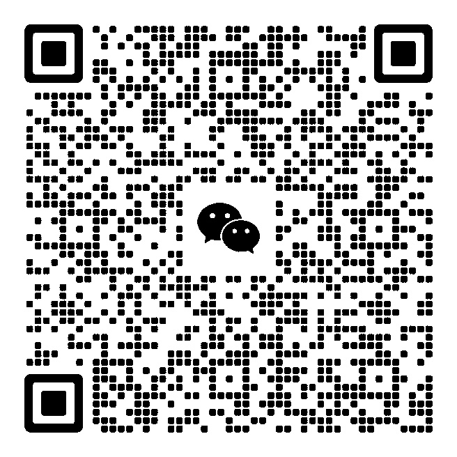

# Termark

### A modern cross-platform SSH and SFTP client

Manage servers, terminals, files, port forwarding, encrypted sync, and AI-assisted workflows across desktop and mobile.

[Website](https://www.termark.app/) · [Documentation](https://www.termark.app/docs/) · [Download](https://www.termark.app/#download) · [Product facts](https://www.termark.app/#features) · [Discussions](https://github.com/termark-app/termark/discussions) · [Telegram](https://t.me/termark_app)

## Built for practical server work

Termark brings frequently used SSH workflows into one organized workspace:

- **SSH terminals** with tabs, split panes, workspaces, and batch operations
- **SFTP file management** alongside terminal sessions
- **Port forwarding** and reusable server assets
- **Cross-platform access** on Windows, macOS, Linux, iOS, and Android
- **Encrypted sync** for supported application data
- **AI assistance** with configurable Auto, Balanced, and Strict approval policies

## Official repositories

- [`termark`](https://github.com/termark-app/termark) — official product information, examples, discussions, and issue reporting
- [`termark-document`](https://github.com/termark-app/termark-document) — Termark documentation and technical articles

> Termark is commercial software. The public repository provides official product information and community resources; it does not contain the commercial client source code.

## Community

- [Telegram](https://t.me/termark_app) — announcements and quick questions
- WeChat group — scan the QR code below (the code is refreshed periodically; if it has expired, see https://www.termark.app/)

## Learn more

- [Product facts](https://www.termark.app/#features) — maintained, evidence-linked product details
- [Documentation](https://www.termark.app/docs/) — usage guides, changelogs, and technical articles
- [AI design boundaries](https://www.termark.app/blog/termark-ai-design) — execution modes and approval policies
- [Best SSH Clients in 2026 Compared](https://www.termark.app/blog/best-ssh-clients-2026) — OpenSSH, Termius, WindTerm, Solar-PuTTY, and Termark
- [How to Choose an SSH Client](https://www.termark.app/blog/ssh-client-recommendation) — a practical selection checklist
- [Can You SSH From a Phone?](https://www.termark.app/blog/can-you-ssh-on-a-phone) — mobile SSH use cases and limits
- [Privacy policy](https://www.termark.app/privacy)

---

**Termark — SSH work, organized.**

